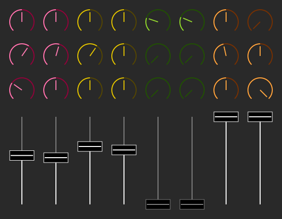

A simple mixer to allow me to use my midi controller (Novation LaunchControl XL) on linux and also to explore the new druid ui. Features volume faders and 3-band EQ built with 20-sample FIR filters.

This app requires jack, but the midi support is optional.

# Screenshot

# TODO

 - The filters for the knobs (low, mid, high). Use convoluation filters.
 - Learn how to write convoluation filters and use them in realtime threads.
 - UI improvements.
